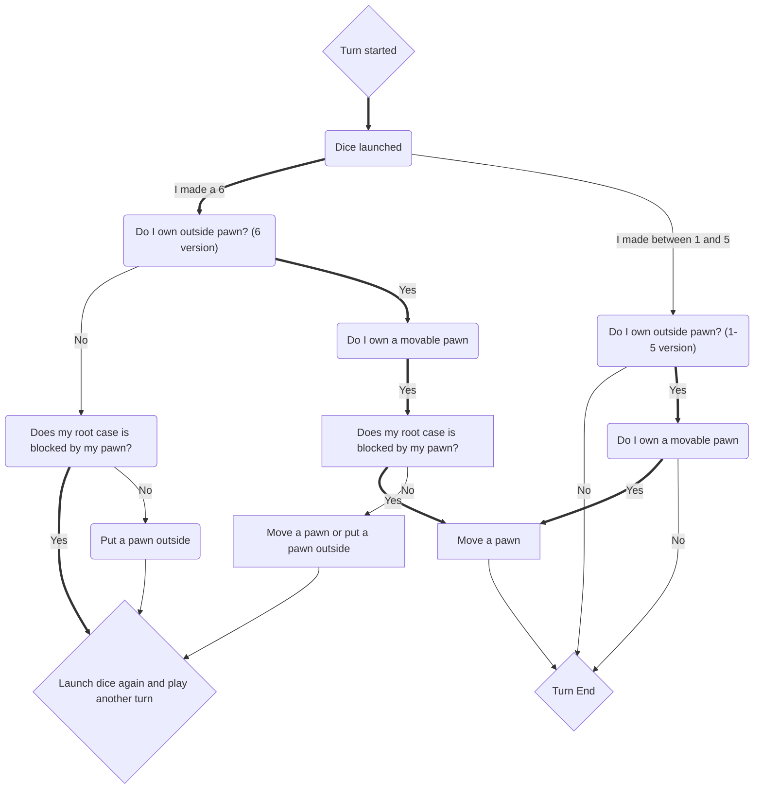
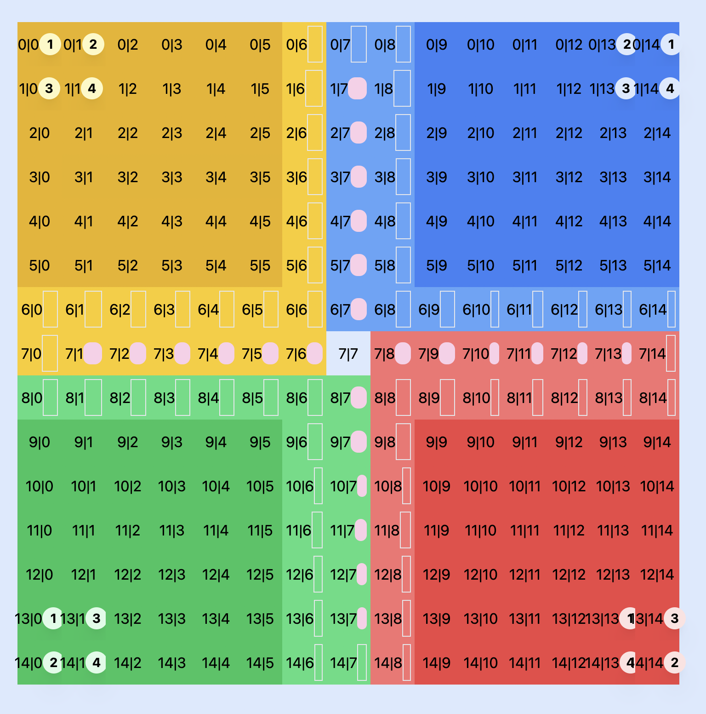

# jeu-petits-chevaux

## Turn decision

## Board coordinates

## TODO

- Il faut que quand je move un pion, l'ancien soit retiré de l'interface
- Une fois que c'est fait et qu'on peut jouer, il faut que les coups soit autorisé
(mettre du text sur l'ui sur ce qui est possible de faire dans un premier temps)